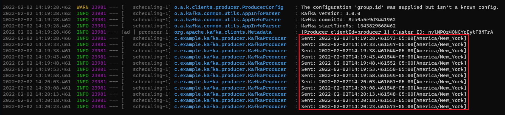
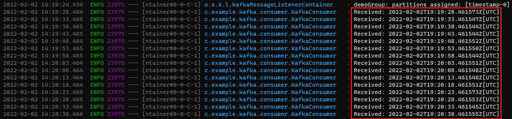

# Kafka Producer/Consumer Using GraalVM Native Image

### Credits

The following lab is based on an [article/example](https://itnext.io/event-driven-architectures-with-kafka-and-java-spring-boot-revision-1-c0d43d103ee7) from Tobias Wissmueller.

### Getting Started

To begin, clone this repository:

```
$ git clone https://github.com/swseighman/Kafka-GraalVM.git
```

```
$ cd Kafka-GraalVM
```

### Configuring and Starting Kafka/Zookeeper

For simplicity, we'll use containers to satisfy the requirement for Kafka.
To start the Kafka/Zookeeper server environment (containers), execute the following command from the root directory of the project:

```
$ docker-compose up -d
Starting java-tutorial_zookeeper_1 ... done
Starting kafka                     ... done
```
```
$ docker ps
CONTAINER ID   IMAGE                    COMMAND                  CREATED          STATUS          PORTS                                                                   NAMES
5c1f06993e72   wurstmeister/kafka       "start-kafka.sh"         43 minutes ago   Up 41 seconds   0.0.0.0:9092->9092/tcp, :::9092->9092/tcp                               kafka
9df66921e2e7   wurstmeister/zookeeper   "/bin/sh -c '/usr/sb…"   44 minutes ago   Up 41 seconds   22/tcp, 2888/tcp, 3888/tcp, 0.0.0.0:2181->2181/tcp, :::2181->2181/tcp   java-tutorial_zookeeper_1
```

Great, our Kafka/Zookeeper servers are up and running.

### Building the Project

From the project root directory, execute the following Maven command:
```
$ mvn clean package
... <snip>
[INFO] ------------------------------------------------------------------------
[INFO] Reactor Summary for kafkalab-parent 0.0.1-SNAPSHOT:
[INFO]
[INFO] producer ........................................... SUCCESS [ 15.661 s]
[INFO] consumer ........................................... SUCCESS [ 14.024 s]
[INFO] kafkalab-parent .................................... SUCCESS [  0.015 s]
[INFO] ------------------------------------------------------------------------
[INFO] BUILD SUCCESS
[INFO] ------------------------------------------------------------------------
[INFO] Total time:  29.876 s
[INFO] Finished at: 2022-02-02T14:37:59-05:00
[INFO] ------------------------------------------------------------------------
```
When completed, both the `producer` and `consumer` applications will have been created.


```
$ ls -lh producer/target/producer-0.0.1-SNAPSHOT.jar
-rw-r--r-- 1 user user 26M Feb  2 14:46 producer-0.0.1-SNAPSHOT.jar

$ ls -lh consumer/target/consumer-0.0.1-SNAPSHOT.jar
-rw-r--r-- 1 user user 26M Feb  2 14:47 consumer-0.0.1-SNAPSHOT.jar
```

Of course, you can run each of the executable JAR files to test your Kafka server is writing and reading records as expected.

Run the Producer:
```
$ java -jar producer/target/producer-0.0.1-SNAPSHOT.jar
```

Run the Consumer:
```
$ java -jar consumer/target/consumer-0.0.1-SNAPSHOT.jar
```


#### Compiling  Native Image Executables
Since native images are built ahead of runtime and their build relies on a static analysis of which code will be reachable, we'll use the GraalVM tracing agent (which tracks all usage of dynamic features of an execution on a regular Java VM) to prepare configuration files for the `native-image` build phase.

We'll begin with the `producer` application.  Change to the `producer` directory:

```
$ cd producer
```

Run the native image tracing agent:

```
$ java -agentlib:native-image-agent=config-output-dir=src/main/resources/META-INF/native-image -jar target/producer-0.0.1-SNAPSHOT.jar
```
Allow the application to run for a minute or two then CTRL-C to stop the app.

You'll notice that configuration files (`.json`) were created and added to the `resources/META-INF/native-image` directory.

Now we can build the `producer` native image exectuable:

```
$ mvn package -Pnative -DskipTests
```

We'll repeat the same process for the `consumer` application. First, restart the `producer`:

```
$ java -jar target/producer-0.0.1-SNAPSHOT-exec.jar
```

Change to the `consumer` directory:

```
$ cd ../consumer
```

Run the native image tracing agent:

```
$ java -agentlib:native-image-agent=config-output-dir=src/main/resources/META-INF/native-image -jar target/consumer-0.0.1-SNAPSHOT.jar
```

Allow the application to run for a minute or two then CTRL-C to stop the app.

Now build the `consumer` native image exectuable:

```
$ mvn package -Pnative -DskipTests
```

### Running the Example

From the `producer` directory, execute:

```
$ target/producer
```

You'll notice the `producer` is writing records to the broker:



Next, start the `consumer`.  From the `consumer` directory, execute:

```
$ target/consumer
```

The `consumer` is now reading records from the topic:

